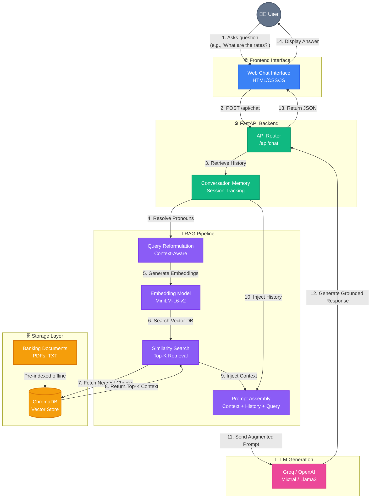

# System Architecture: GenAI Banking Support Chatbot

This diagram illustrates the end-to-end data flow of the Banking Support Chatbot, detailing how the Frontend, Backend, Vector Database, and LLM Generation interact during a user query.

