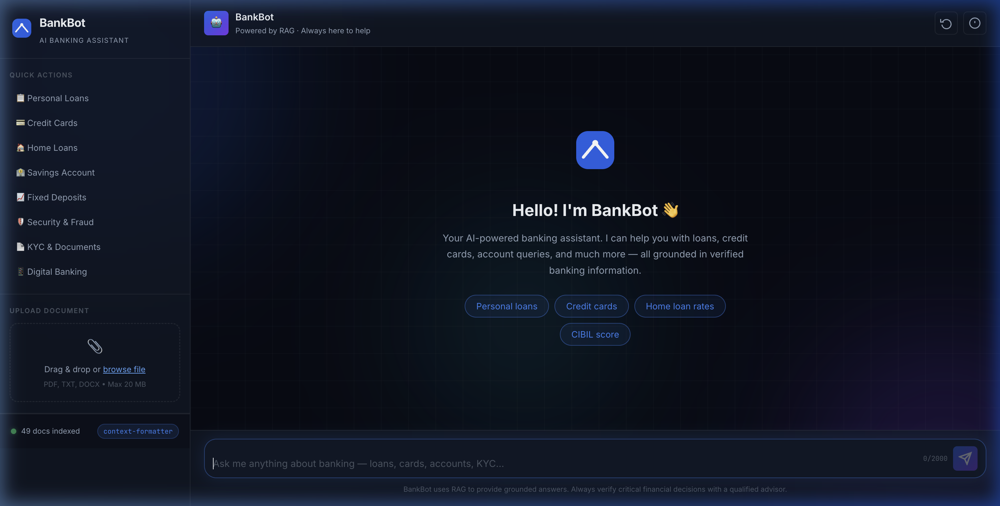
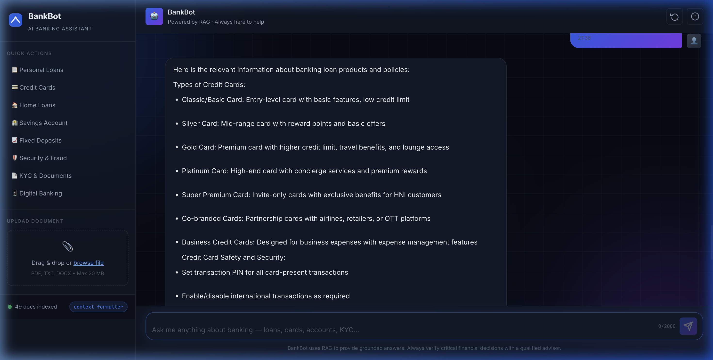
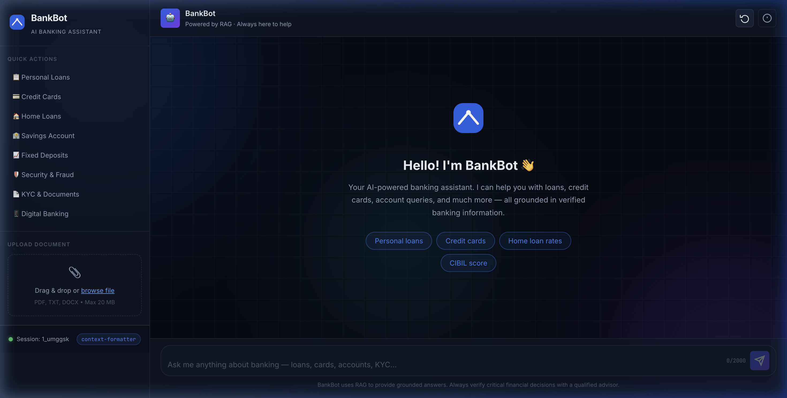
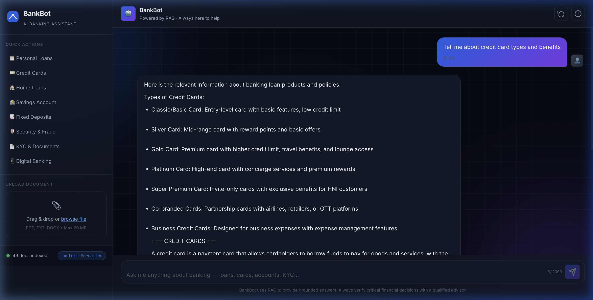

<!-- Banner -->
<div align="center">

# 🏦 GenAI Banking Support Chatbot

### AI-Powered Customer Support using Retrieval-Augmented Generation (RAG)

[](https://github.com/zairakhaan786/GenAI-Banking-Support-Chatbot/actions)
[](https://python.org)
[](https://fastapi.tiangolo.com)
[](https://www.trychroma.com)
[](https://langchain.com)

**A production-ready AI banking assistant that answers customer queries about loans, credit cards, accounts, and banking policies — grounded in verified knowledge via RAG.**

[🚀 Live Demo](#-deployment) · [📖 API Docs](http://localhost:8000/api/docs) · [🏗️ Architecture](docs/architecture.md)

</div>

---

## 🎯 Assignment Deliverables Coverage

This project strictly adheres to the provided assignment requirements. Here is how every deliverable is mapped:

- ✅ **Source Code**: Fully modularized and structured across `backend/`, `frontend/`, `rag_pipeline/`, `vector_db/`, and `api/`.
- ✅ **README**: This concise and crisp professional document.
- ✅ **Setup Instructions**: Detailed below in the Quick Start section.
- ✅ **Architecture Explanation**: Documented thoroughly in `docs/architecture.md` with flow diagrams.
- ✅ **Cloud Deployment**: Configured via `deployment/render.yaml` and deployed on Render.
- ✅ **RAG Pipeline**: Implemented in `rag_pipeline/` with document ingestion, text chunking, and embedding generation.
- ✅ **Vector DB Implementation**: Implemented using ChromaDB in `vector_db/`.
- ✅ **Backend APIs**: Built with FastAPI in `api/` (`/chat`, `/upload`, `/health`).
- ✅ **Context Retention**: Conversation memory handled by `rag_pipeline/memory.py` resolving pronouns naturally.
- ✅ **Chatbot Interface**: A responsive, premium banking UI found in `frontend/`.

---

## 📸 Screenshots

<table>
<tr>
<td width="50%">
<b>Chat Interface</b><br/>

</td>
<td width="50%">
<b>Context-Aware Response</b><br/>

</td>
</tr>
<tr>
<td width="50%">
<b>Upload Document Screen</b><br/>

</td>
<td width="50%">
<b>Credit Cards Response</b><br/>

</td>
</tr>
</table>

---

## ✨ Features

- **Full RAG Pipeline**: Document ingestion → chunking → embedding → retrieval → generation
- **Conversation Memory**: Session-aware context, resolves pronouns like "it", "that loan"
- **Document Upload**: Index custom PDFs, TXTs, and DOCXs at runtime
- **ChromaDB Integration**: Persistent vector store with cosine similarity search
- **Premium UI**: Professional banking theme, responsive layout, typing/loading animations
- **REST APIs**: Validated endpoints using FastAPI
- **CI/CD**: GitHub Actions for linting, tests, and build validation

---

## 🧠 RAG Implementation Details

The core of this system is the **Retrieval-Augmented Generation (RAG)** pipeline located in `rag_pipeline/` and `vector_db/`.

1. **Document Ingestion & Chunking**: `document_processor.py` processes raw text from PDFs and TXT files and splits it into semantic chunks (size 600, overlap 80).
2. **Embedding Generation**: `embeddings.py` uses `all-MiniLM-L6-v2` locally to convert text chunks into vector embeddings.
3. **Vector Database Integration**: `vector_store.py` manages a ChromaDB instance to store and persist these embeddings.
4. **Semantic Retrieval**: When a query arrives, it performs a mathematical cosine similarity search to retrieve the top 5 most relevant chunks.
5. **Context-Aware LLM Generation**: `memory.py` resolves pronouns (e.g. "What is it?") using previous conversation history. `llm_service.py` then generates a response using the retrieved context.

---

## 🚀 Quick Start

### 1. Clone & Setup
```bash
git clone https://github.com/zairakhaan786/GenAI-Banking-Support-Chatbot.git
cd GenAI-Banking-Support-Chatbot

# Create virtual environment
python3 -m venv venv && source venv/bin/activate

# Install dependencies
pip install -r backend/requirements.txt
```

### 2. Configure Environment
Copy `.env.example` and add your LLM API Keys (Groq is recommended).
```bash
cp backend/.env.example backend/.env
```

### 3. Run Locally
Ensure you are in the root directory and your `PYTHONPATH` includes the current directory.
```bash
PYTHONPATH=. uvicorn backend.app.main:app --host 0.0.0.0 --port 8000
```
Open **http://localhost:8000** to use the application!

---

## 📡 API Endpoints

- **`POST /api/chat`**: Submit a query and session ID to receive a RAG-powered response.
- **`POST /api/upload`**: Upload a `.txt`, `.pdf`, or `.docx` file to be dynamically indexed into the vector DB.
- **`GET /api/health`**: Check the system status and component health.

See `http://localhost:8000/api/docs` for the interactive Swagger documentation.

---

## 📁 Repository Structure

```
GenAI-Banking-Support-Chatbot/
├── api/                   # REST API routes (chat, health, upload)
├── backend/               # Main FastAPI application, config, and models
├── deployment/            # Docker, Render YAML configs
├── docs/                  # Architecture diagrams and documentation
├── frontend/              # UI/UX (HTML, CSS, JS) - modern banking theme
├── rag_pipeline/          # Core RAG orchestration, memory, LLM, processor
├── screenshots/           # Application screenshots for README
├── vector_db/             # ChromaDB integration and semantic retrieval
├── .github/workflows/     # CI/CD pipelines
└── README.md              # Project documentation
```

---

## ☁️ Deployment

The application is configured for automatic deployment on Render using the `deployment/render.yaml` file. 

To deploy:
1. Push this repository to GitHub.
2. Connect it to Render via a New Web Service.
3. Render reads `deployment/render.yaml` (configured in settings or loaded directly) and deploys both backend and frontend seamlessly.

**GitHub Repository:** [https://github.com/zairakhaan786/GenAI-Banking-Support-Chatbot](https://github.com/zairakhaan786/GenAI-Banking-Support-Chatbot)  
**Live Deployment:** `https://genai-banking-chatbot.onrender.com`

---

## 🔮 Future Improvements

- **Streaming responses**: Implementing Server-Sent Events (SSE) for real-time streaming.
- **Authentication**: User accounts for personalized banking histories.
- **Analytics**: Dashboards to track popular queries and refine the knowledge base.
